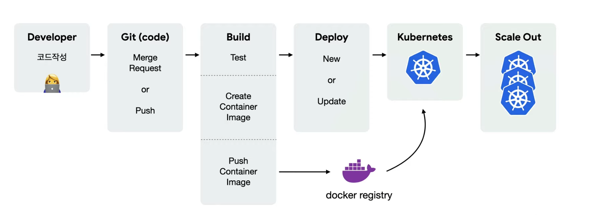
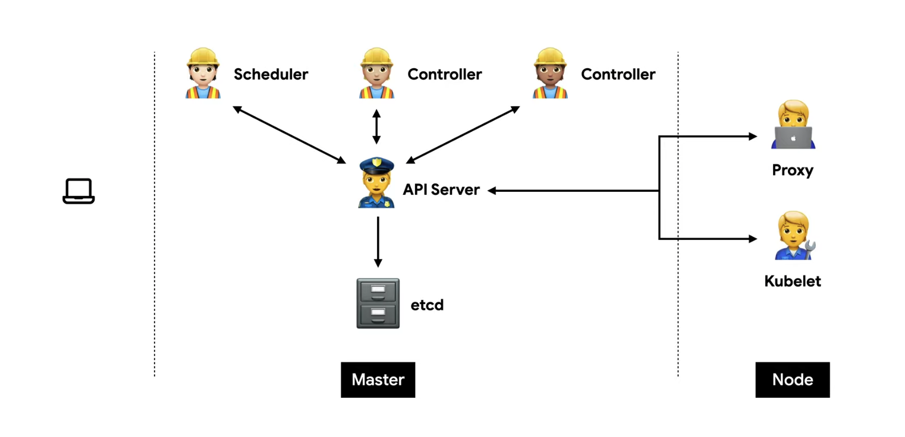
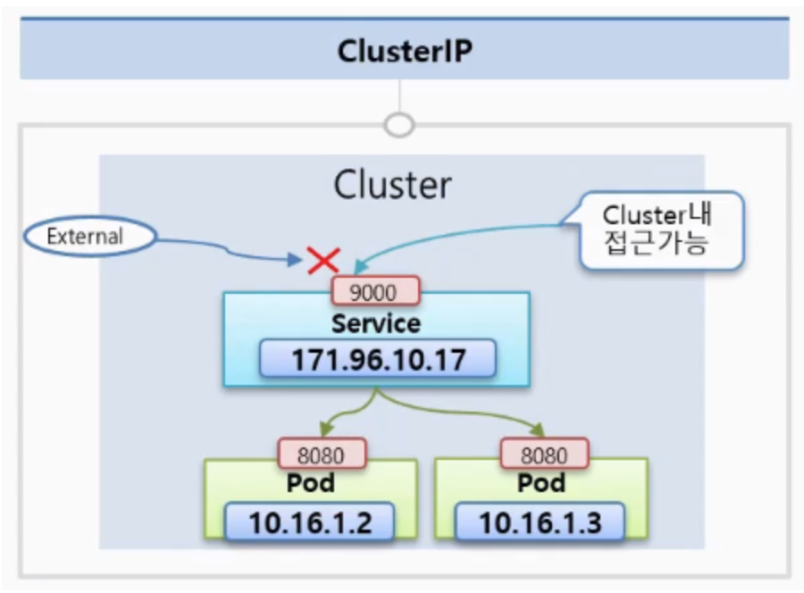
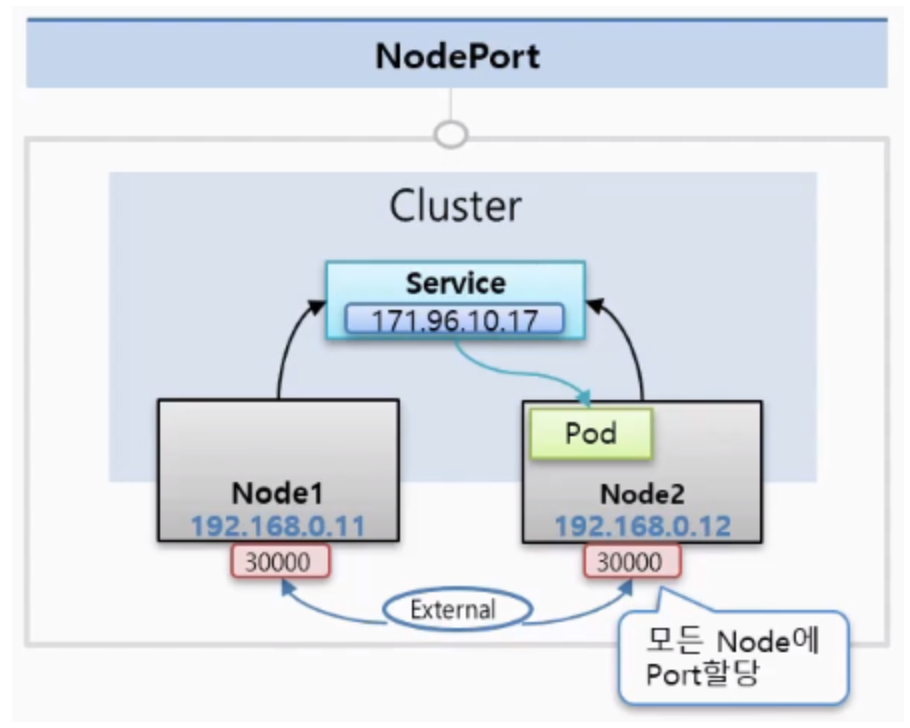
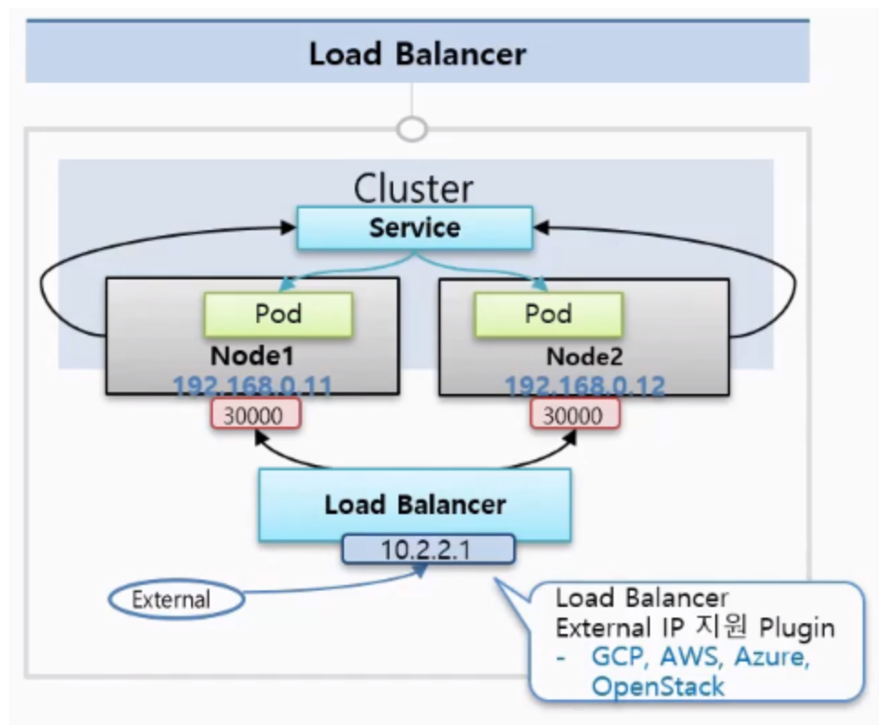
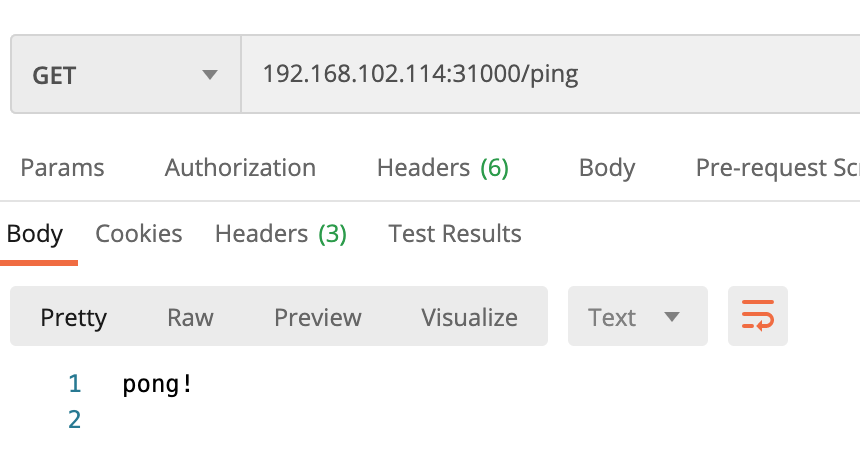

<br>

> # 쿠버네티스 
컨테이너화 된 애플리케이션을 자동으로 배포, 스케일링 및 관리해주는 오픈소스 시스템



<br><br><br>

쿠버네티스는 '원하는 상태'를 유지하는 것이 핵심이다.<br><br>

## Desired State <br>

1. 상태체크(Observe) <br>
Current State == Desired State<br>

2. 차이점 발견(Diff)<br>
Current State != Desired State<br>

3. 조치(Act)<br>
Current State => Desired State<br>



## Master

### etcd
모든 상태와 데이터를 저장<br>
Key(directory)-Value 형태로 데이터 저장

### API server
상태를 바꾸거나 조회<br>
etcd와 유일하게 통신하는 모듈<br>
REST API 형태로 제공<br>
권한을 체크하여 적절한 권한이 없을 경우 요청을 차단<br>
관리자 요청 뿐 아니라 다양한 내부 모듈과 통신<br>
요청이 많으므로 수평으로 확장하도록 디자인 되어있음 <br>

### Scheduler
새로 생성된 Pod를 감지하고 실행할 노드를 선택 <br>
노드의 현재 상태와 Pod의 요구사항 체크<br>

### Controller
논리적으로 다양한 컨트롤러가 존재<br>
끊임없이 상태를 체크하고 원하는 상태를 유지<br>
복잡성을 낮추기 위해 하나의 프로세스로 실행<br>
 
 ***

## Node

### kubelet
직접 pod과 통신<br>
각 노드마다 존재<br>
Pod을 실행/중지하고 상태를 체크<br>

### proxy
네트워크 프록시와 부하 분산 역할

<br><br>

## API 호출하기 
원하는 상태(desired state)를 다양한 오브젝트(object)로 정의(spec)하고 API 서버에 yaml 형식으로 전달한다.

<br><br><br>

# yml 필수 요소 

```yml
apiVersion: v1
kind: Pod
metadata:
  name: echo
  labels:
    app: echo
spec:
  containers:
    - name: app
      image: ghcr.io/subicura/echo:v1
```

<br>

|정의|설명|예|
|------|---|---|
|version|오브젝트 버전|v1, app/v1, networking.k8s.io/v1|
|kind|종류|Pod, ReplicaSet, Deployment, Service|
|metadata|메타데이터|name과 label, annotation(주석)으로 구성|
|spec|상세명세|리소스 종류마다 다름|

<br><br>

# kubectl command 

### 기본 명령어

|명령어|설명|
|----|----|
|create| 원하는 상태 적용. 보통 -f 옵션으로 파일과 함께 사용|
|delete| 리소스를 제거|
|get|리소스 목록|
|describe|리소스의 상태를 자세하게 보여준다.|
|logs| 컨테이너의 로그|
|exec|컨테이너에 접근할 때 사용. 컨테이너에 명령어를 전달. |
|config| kubectl 설정을 관리 |

<br>

```bash
[root@platform-group-k8s-1 test1]# kubectl create -f nginx-deployment.yml -n hb-test
deployment.apps/nginx created

[root@platform-group-k8s-1 test1]# kubectl delete -f wp-mysql.yml -n hb-test
deployment.apps "wordpress-mysql" deleted
service "wordpress-mysql" deleted
deployment.apps "wordpress" deleted
service "wordpress" deleted

[root@platform-group-k8s-1 test1]# kubectl get svc -n hb-test
NAME          TYPE       CLUSTER-IP     EXTERNAL-IP   PORT(S)          AGE
my-nodeport   NodePort   10.1.228.120   <none>        9000:31000/TCP   3d4h

kubectl exec [POD] -- [COMMAND]
[root@platform-group-k8s-1 test1]# kubectl exec -it myapp-pod -n hb-test -- /bin/sh
/workspace/test #
```


Endpoint : 서비스의 접속정보

```bash
$ kubectl describe ep/[서비스이름] 
```

<br><br>


# Object 

## Pod
Pod은 쿠버네티스에서 관리하는 가장 작은 배포 단위. <br>
쿠버네티스와 도커의 차이점은 도커는 컨테이너를 만들지만, 쿠버네티스는 컨테이너 대신 Pod을 만든다. Pod은 한 개 또는 여러 개의 컨테이너를 포함할 수 있다.<br>

격리된 논리공간 namespace 생성

```bash
$ kubectl create namespace hb-test
```

yaml 파일로 pod 생성

```yml
apiVersion: v1
kind: Pod
metadata:
  name: myapp-pod
  namespace: hb-test
  labels:
    app: myapp
spec:
  containers:
    - name: myapp-container
      image: repo.iris.tools/hb/hb-image:v1.0
```

실행/확인

```bash
$ kubectl create -f sample-pod.yml -n hb-test
$ kubectl get pod -n hb-test
NAME        READY   STATUS    RESTARTS   AGE
myapp-pod   1/1     Running   0          26s
$ kubectl exec -it myapp-pod -n hb-test -- /bin/sh
/workspace/test # ls
Dockerfile        go.mod            go.sum            run_my_docker.sh  test1             test1.go
```

<br><br>


***

## ReplicaSet
Pod를 단독으로 만들면 Pod에 어떤 문제(서버가 죽어서 Pod이 사라졌다던가)가 생겼을 때 자동으로 복구되지 않는다. <br>
이러한 Pod을 정해진 수만큼 복제하고 관리하는 것이 ReplicaSet이다. <br>

ReplicaSet 예시<br>
replicas opbejct에 app=nginx인 pod 3개를 정의하고 생성해준다.

```yml
apiVersion: apps/v1
kind: ReplicaSet
metadata: 
  name: nginx
  namespace: hb-test
  labels:
    app: nginx
spec:
  replicas: 3
  selector: 
    matchLabels: 
      app: nginx
  template:
    metadata: 
      labels: 
        app: nginx
        tier: app
    spec:
      containers:  
        - name: nginx
          image: nginx:latest
```

<br>

```bash
[root@platform-group-k8s-1 test1]# kubectl get pod --show-labels -n hb-test
NAME                     READY   STATUS    RESTARTS   AGE     LABELS
nginx-57796d7dff-c6z4r   1/1     Running   0          2m     app=nginx,pod-template-hash=57796d7dff
nginx-57796d7dff-kr2rh   1/1     Running   0          2m     app=nginx,pod-template-hash=57796d7dff
nginx-57796d7dff-zjjhf   1/1     Running   0          2m     app=nginx,pod-template-hash=57796d7dff
```

app- 옵션으로 하나의 pod의 app라벨을 제거해준다. 

```bash
[root@platform-group-k8s-1 test1]# kubectl label pod/nginx-57796d7dff-c6z4r app- -n hb-test
pod/nginx-57796d7dff-c6z4r labeled
```

해당 pod에 대해 기존에 생성된 app 라벨이 사라지면서 selector에 정의한 app=nginx조건을 만족하는 pod의 개수가 2가 되어 이를 만족하는 pod이 하나 더 생성되었다.

```bash
[root@platform-group-k8s-1 test1]# kubectl get pod --show-labels -n hb-test
NAME                     READY   STATUS    RESTARTS   AGE     LABELS
nginx-57796d7dff-6qfzj   1/1     Running   0          10s     app=nginx,pod-template-hash=57796d7dff
nginx-57796d7dff-c6z4r   1/1     Running   0          3m      pod-template-hash=57796d7dff
nginx-57796d7dff-kr2rh   1/1     Running   0          3m      app=nginx,pod-template-hash=57796d7dff
nginx-57796d7dff-zjjhf   1/1     Running   0          3m      app=nginx,pod-template-hash=57796d7dff
```

<br>

***

## Deployment
Deployment는 쿠버네티스에서 가장 널리 사용되는 오브젝트이다.<br>
ReplicaSet을 이용하여 Pod를 업데이트하고 이력을 관리하여 Rollback하거나 특정버전으로 돌아갈 수 있다.

ReplicaSet에서 사용했던 파일에 kind만 바꿔주고 실행해준다.

```yml
apiVersion: apps/v1
kind: Deployment
metadata: 
  name: nginx
  namespace: hb-test
  labels:
    app: nginx
spec:
  replicas: 3
  selector: 
    matchLabels: 
      app: nginx
  template:
    metadata: 
      labels: 
        app: nginx
        tier: app
    spec:
      containers:  
        - name: nginx
          image: nginx:1.14.2
```

<br>

```bash
[root@platform-group-k8s-1 test1]# kubectl create -f nginx-deployment.yml -n hb-test
deployment.apps/nginx created
[root@platform-group-k8s-1 test1]# kubectl get po,rs,deploy -n hb-test
NAME                         READY   STATUS    RESTARTS   AGE
pod/nginx-5f6587f7f8-2fchs   1/1     Running   0          14s
pod/nginx-5f6587f7f8-cmwq6   1/1     Running   0          15s
pod/nginx-5f6587f7f8-xnm6d   1/1     Running   0          14s

NAME                               DESIRED   CURRENT   READY   AGE
replicaset.apps/nginx-5f6587f7f8   3         3         3       15s

NAME                    READY   UP-TO-DATE   AVAILABLE   AGE
deployment.apps/nginx   3/3     3            3           15s
```

이제 기존 설정에서 이미지 태그만 바꿔주고 다시 적용해준다.
```bash
[root@platform-group-k8s-1 test1]# kubectl set image deployment/nginx nginx=nginx:1.16.1 --record  -n hb-test
deployment.apps/nginx image updated
```

기존 3개의 pod이 terminating 되고 3개가 새로 생긴다.

```bash
[root@platform-group-k8s-1 test1]# kubectl get po,rs,deploy -n hb-test
NAME                         READY   STATUS    RESTARTS   AGE
pod/nginx-757bd75865-7fcq8   1/1     Running   0          19s
pod/nginx-757bd75865-8xznf   1/1     Running   0          16s
pod/nginx-757bd75865-gjbl9   1/1     Running   0          39s

NAME                               DESIRED   CURRENT   READY   AGE
replicaset.apps/nginx-5f6587f7f8   0         0         0       2m16s
replicaset.apps/nginx-757bd75865   3         3         3       39s

NAME                    READY   UP-TO-DATE   AVAILABLE   AGE
deployment.apps/nginx   3/3     3            3           2m16s
```


<br><br>


# Service
Pod는 자체 IP를 가지고 다른 Pod와 통신할 수 있지만, 쉽게 사라지고 생성되는 특징 때문에 직접 통신하는 것을 권장하지 않는다. 대신 별도의 고정된 IP를 가진 <b>Service</b>를 만들고 그 서비스를 통해 Pod에 접근하는 방식을 사용한다. <br>
이때 이 Service는 노출범위에 따라 ClusterIP, NodePort, LoadBalancer로 나뉘어진다. 

### ClusterIP



ClusterIP는 클러스터 내부에 새로운 서비스의 고유 IP를 할당하고 여러개의 Pod를 바라보는 로드밸런서 기능을 제공한다. 따라서 이 IP는 k8s 클러스터 내에서만 접근이 가능하다. 또한 Pod를 여러개 연결 할 수 있고 트래픽을 분산해서 Pod에 전달해준다. 

<br>

### NodePort



NodePort는 k8s 클러스터에 연결되어 있는 모든 Node에게 똑같은 Port가 할당이 되어서 외부로부터 어느 Node던간에 그 IP의 포트로 접속을 하면 해당 Service에 연결이 되고, 이 Servcie는 자신에 연결되어 있는 Pod에 트래픽을 전달해준다. <br>
(NodePort는 CluterIP의 기능을 기본으로 포함.)

<br>

### Load Balancer


NodePort는 노드가 사라졌을때 자동으로 다른 노드를 통해 접근이 불가능하다. 자동으로 살아있는 노드에 접근하기 위해서는 모든 노드를 바라보는 Load Balancer가 필요하다. <br>
(LoadBalancer는 NodePort의 기능을 기본으로 포함.)

<br><br>

# Service 실습 - Pod을 외부에 노출시키기 

NodePort를 이용해서 외부에서 접속할 수 있도록 해보자.<br> 

sample-pod.yml
```yml
apiVersion: v1
kind: Pod
metadata:
  name: myapp-pod
  namespace: hb-test
  labels:
    app: helloApp
spec:
  containers:
     - name: myapp-container
       image: repo.iris.tools/hb/hb-image:v1.0
       ports:
          - containerPort: 1322
            protocol: TCP
```

이전에 작성한 pingpong 서버의 포트번호가 1322였으므로 여기서도 pod의 포트번호를 1322로 맞춰준다. <br><br>

my-nodeport.yml
```yml
apiVersion: v1
kind: Service
metadata:
  name: my-nodeport
spec:
  type: NodePort
  ports:
    - port: 9000
      targetPort: 1322
      nodePort: 31000
  selector:
    app: helloApp
```

targetPort는 nodeport service가 찾아갈 pod의 포트번호 1322로 지정해준다. 
<br><br>

실행

```bash
$ kubectl create -f sample-pod.yml
$ kubectl create -f my-nodeport.yml

$ kubectl get all -n hb-test
NAME               READY   STATUS    RESTARTS   AGE
pod/myapp-pod   1/1     Running   0          52m

NAME                  TYPE       CLUSTER-IP     EXTERNAL-IP   PORT(S)          AGE
service/my-nodeport   NodePort   10.1.158.241   <none>        9000:31000/TCP   48m
```

노드의 공용 ip를 확인해서(ifconfig)<br>
node의 ip:nodeport 로 GET 요청 날리기

```bash
$ curl 192.168.102.114:31000/ping
pong!
```


<br><br>


## 헷갈리는 개념 정리해보기

```yml
apiVersion: apps/v1
kind: Deployment
metadata: #1
  name: nginx
  labels:
    app: nginx
    tier: backend
spec:
  selector: #2
    matchLabels:
      app: nginx
  template: #3
    metadata:
      labels:
        app: nginx
        tier: backend
...
```

## metadata와 selector와 template에 관하여<br>

먼저, 맨 위의 metadata(#1)는 deployment그 자체에 대한 설명이다. 따라서 이 deployment를 지우고 싶으면 아래 명령어로 지울 수 있다.  

```bash
kubectl delete -l app=nginx,tier=backend 
```

<br>
selector(#2)는 해당 Pods을 deployment와 연결(link)해 준다.
<br>
template(#3)은 podTemplate 이다. 이 부분에서는 실행되는 pod에 대해 기술한다. 따라서 이 부분에 쓰여지는 label은 해당 deployment가 아니라 실행되는 pod에 대한 label이다.<br><br>

<br><br><br>

### 그림출처 
https://www.youtube.com/watch?v=Ia8IfowgU7s <br>
https://dev-youngjun.tistory.com/20
