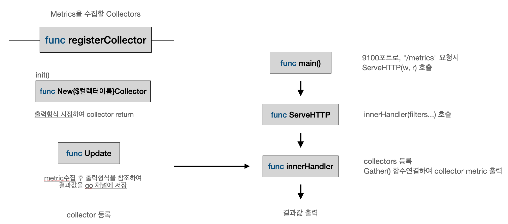

# Node Exporter 구조 분석



<br>

## 주요 함수 

### node_exporter.go 

```go
http.Handle(*metricsPath, newHandler(!*disableExporterMetrics, *maxRequests, logger))
http.HandleFunc("/", func(w http.ResponseWriter, r *http.Request) {
    w.Write([]byte(`<html>
        <head><title>Node Exporter</title></head>
        <body>
        <h1>Node Exporter</h1>
        <p><a href="` + *metricsPath + `">Metrics</a></p>
        </body>
        </html>`))
})
```


```go
//registry를 새로 생성해주고; pre-registered
r := prometheus.NewRegistry()


r.MustRegister(version.NewCollector("node_exporter"))
if err := r.Register(nc); err != nil {
    return nil, fmt.Errorf("couldn't register node collector: %s", err)
}


handler := promhttp.HandlerFor(
    //Gatherers 생성
    prometheus.Gatherers{h.exporterMetricsRegistry, r},
    promhttp.HandlerOpts{
        ErrorHandling:       promhttp.ContinueOnError,
        MaxRequestsInFlight: h.maxRequests,
        Registry:            h.exporterMetricsRegistry,
    },
)
```


