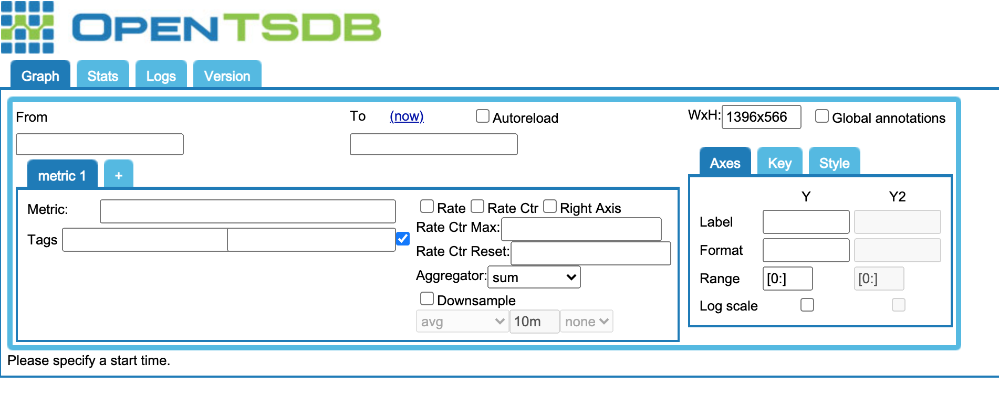

# OpenTSDB란?

### OpenTSDB란 Hbase 기반의 Open source Time Series Database 이다. <br>

> [Github 코드](https://github.com/OpenTSDB/opentsdb) <br>

Open TSDB는 컴퓨터 시스템(OS, Network, appliaction 등 )에서 수집된 metrics들을 store, index and serve 하기 위해 만들어졌다. <br>
TSDB는 Row 기반인 관계형 데이터페이스(RDB)와 달리 Column 기반인 NoSQL Database이다. RDB와 달리 스키마가 없으므로 읽고 쓰기가 빠르고 운영 중 서버의 확장이 가능하다.<br>

또한 Hbase의 확장성 덕분에 OpenTSDB는 수만 개의 호스트 및 응용 프로그램에서 수천개의 metric을 고속으로 매 초마다 수집할 수 있다. <br> 대규모 데이터에 쉽게 접근할 수 있고 도식화 하기 편리하도록 만들어 졌기 때문에 모니터링에 사용하기 좋다. 

<br>

## 작동원리


수집 대상인 server에 설치된 collector 클라이언트가 TSD(Time Series Daemon)서버로 전송하면 TSD가 Hbase에 저장한다.
OpenTSDB는 http api, web ui, telnet을 통한 읽기/쓰기를 지원한다.


<br>

# 기본 설정

OpenTSDB도 production level에서 사용하려면 HBase 설정이 필요하다. <br>
> [Hbase 설정법](http://engineering.vcnc.co.kr/2013/04/hbase-configuration/)

<br>
여기서는 개발 및 학습 목적으로서 docker 컨테이너로 띄워 보자. <br>
docker hub에서 open tsdb를 검색하면 가장 많이 사용되는 container를 다운받아서 실행할 수 있다. 

> [링크](https://hub.docker.com/r/petergrace/opentsdb-docker/)


```sh
[root@k8s-dev ]# docker pull petergrace/opentsdb-docker
Using default tag: latest
latest: Pulling from petergrace/opentsdb-docker
188c0c94c7c5: Pull complete
0482a7a172c0: Pull complete
1838cd58688f: Pull complete
...
b7313d7365bd: Pull complete
Digest: sha256:05d396f19800260c9bcfc918dbab97c289cf5f94cd90abed03adb357244516f0
Status: Downloaded newer image for petergrace/opentsdb-docker:latest
docker.io/petergrace/opentsdb-docker:latest
[root@k8s-dev ]# docker run -dp 4242:4242 petergrace/opentsdb-docker
85b619f7c112f80e615e4abf86ede8ae38276d5101d9c8e28462464e8adc8dce
```

<br>

# 사용법

TSDB 데이터 입출력은 <b>내장된 GUI</b> 또는 <b>HTTP API</b>를 이용할 수 있다. <br>

## Build-in GUI: 
내장 GUI는 기본적인 read/write가 가능하며, 간단한 그래프를 보여준다.<br>
http://localhost:4242/ 로 접속


## HTTP API:

### Telnet style(POST): 
```sh
<Metric Name> <Timestamp in epoch> <Value> <tag kye>=<tag value>

#Example
telnet> room_temperature 1588334464 33 floor=1 room_number=10
```
 


### HTTP Style(GET/POST):<br>

GET 주요 Requests<br>

> [자세한 api requests](http://opentsdb.net/docs/build/html/api_http/query/index.html)

|Name|필수|QS|설명 
|--|--|--|--|
|start|필수|start|qeury의 시작시간. <br>절대적(unix timestamp),상대적(1h-ago) 시간이 올 수 있다.  
|queries|필수|m or tsuids|시간별 데이터를 출력하기 위해서는 하나 이상의 sub query가 필요하다. 

```sh
#POST
http://<ip-address-of-machine>:<port>/api/put?details

#GET
http://<ip-address-of-machine>:<port>/api/qeury?start=${이 시간 이후의 데이터 출력}}&m=${sub queries}
```

# Test
아래 JSON 데이터를 POST/GET 해보기 (timestamp는 테스트 당시 시간의 unix timestamp)
```sh
[
    {
        "metric": "node_container_cpu_cstime",
        "timestamp": 1615879522,
        "value": 71294,
        "tags": {
           "id": "cont1",
           "pid": "319"
        }
    },
    {
        "metric": "node_container_cpu_cstime",
        "timestamp": 1615879522,
        "value": 150,
        "tags": {
           "id": "cont2",
           "pid": "345"
        }
    },
    {
        "metric": "node_container_cpu_cutime",
        "timestamp": 1615879522,
        "value": 2,
        "tags": {
           "id": "cont1",
           "pid": "319"
        }
    }
]
```

POST

```sh
$ curl -X POST -H "Content-Type: application/json" -d \
'[
    {
        "metric": "node_container_cpu_cstime",
        "timestamp": 1615879522, 
        "value": 71294,
        "tags": {
           "id": "cont1",
           "pid": "319"
        }
    },
    {
        "metric": "node_container_cpu_cstime",
        "timestamp": 1615879522,
        "value": 150,
        "tags": {
           "id": "cont2",
           "pid": "345"
        }
    },
    {
        "metric": "node_container_cpu_cutime",
        "timestamp": 1615879522,
        "value": 2,
        "tags": {
           "id": "cont1",
           "pid": "319"
        }
    }
]' \
http://localhost:4242/api/put?details

# 결과값
{"success":3,"failed":0,"errors":[]}
```

GET

```sh
#한시간 전 부터 현재까지의 데이터 중에 node_container_cpu_cstime metric의 value값 중 max 값
$ curl -X GET -H "Content-Type: application/json" \
"http://localhost:4242/api/query?start=1h-ago&m=max:node_container_cpu_cstime" 

#parsed result
[ 
    {
        "metric":"node_container_cpu_cstime",
        "tags":{},
        "aggregateTags":[
            "pid",
            "id"
        ],
        "dps":{
            "1615879522":71294
        }
    }
]
```


# 쿼리

localhost:4242로 curl 을 날려보면 openTSDB gui 화면을 구성하는 html이 뜬다.


<br>

write 

```sh

[root@k8s-dev ~] curl -X POST -H "Content-Type: application/json; charset=utf-8" -d \
'{"metric": "sys.cpu.nice", "timestamp": 1546957946, "value": 18, "tags": {"host": "deo"}}' \
http://localhost:4242/api/put?details
{"success":1,"failed":0,"errors":[]}
```

read
```sh
[root@k8s-dev ~] curl -X GET -H "Content-Type: application/json; charset=utf-8" "http://localhost:4242/api/query?start=1546957946&m=sum:sys.cpu.nice"
[{"metric":"sys.cpu.nice","tags":{"host":"deo"},"aggregateTags":[],"dps":{"1546957946":18}}]

# parsing 
{
  "metric":"sys.cpu.nice",
  "tags":{
      "host":"deo"
  },
  "aggregateTags":[],
  "dps":{
      "1546957946":18
  }
}
```

<br>

# Query API Endpoints


Request 압축 예시
```sh
$ gzip -9c clear-32k.json > gzip-32k.json

$ file gzip-32k.json
gzip-32k.json: gzip compressed data, was "clear-32k.json", from Unix, last modified: Thu Jan 16 15:31:55 2014

$ ls -l gzip-32k.json
-rw-r--r-- 1 root root 1666 févr.  4 09:57 gzip-32k.json

$ curl -X POST --data-binary "@gzip-32k.json" --header "Content-Type: application/json" --header "Content-Encoding: gzip" http://mytsdb1:4242/api/put?details
{"errors":[],"failed":0,"success":280}
```


## Gopkg 로 활용하기

go에서는 OpenTSDB 서버와 상호작용하기위한 패키지를 제공한다. [링크](https://pkg.go.dev/bosun.org/opentsdb)


# 참고 사이트
(https://medium.com/analytics-vidhya/understanding-opentsdb-a-distributed-and-scalable-time-series-database-e4efc7a3dbb7)