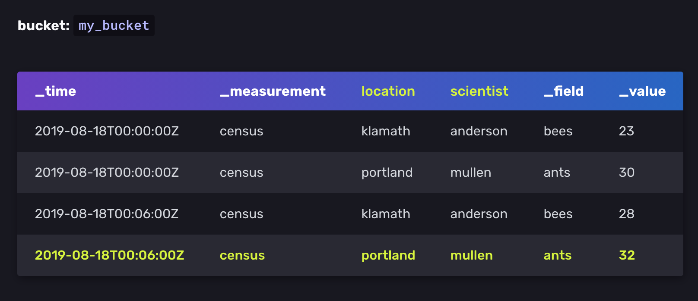
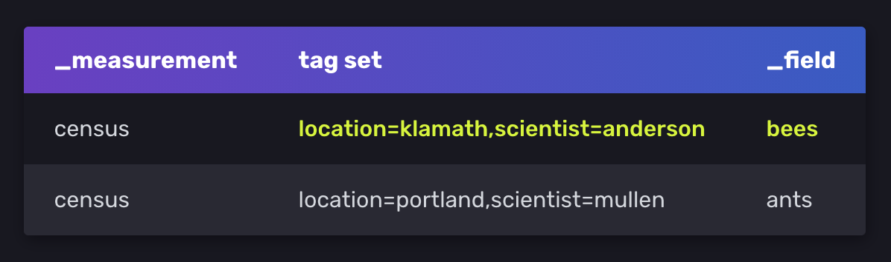
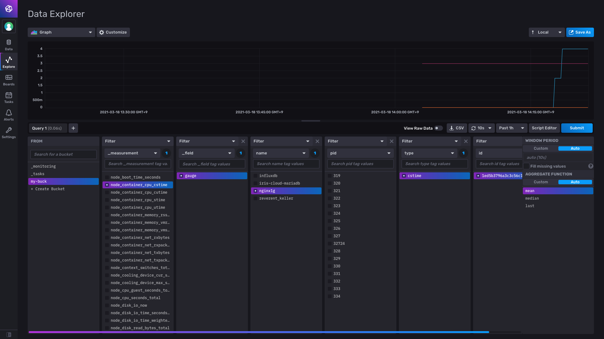

---
layout: post
published: On
title: TSDB | InfluxDB
category: monitoring
subtitle: 모니터링을 위한 시계열 데이터베이스 TSDB - InfluxDB
date: '2021-03-16'
---  

# InfluxDB 

InfluxDB는 거대한 크기의 시계열 데이터를 저장하고, 그 데이터를 실 시간에 준하는 속도로 분석하기 위하여 설계된 TSDB 이다. <br>
Go 언어로 개발되었으며 ~~~RDB의 SQL과 유사한 조작 언어 InfluxQL을 제공하기 때문에 사용이 편리하다.~~~ <b>2.x 버전 이후로 Flux 권장</b> <br>
단일 노드에서 동작하는 제품은 무료이며, 다중 노드 지원을 위한 클러스터 버전의 경우에는 상용으로 구매해야 한다. 

> ## TSDB란? 
> Time Series Database. '하나 이상의 시간'과 '하나 이상의 값' 쌍을 통해 시계열을 저장하고 서비스하는데 최적화된 소프트웨어 시스템이다. <br> 특정 데이터를 찾는데는 SQL이 유용하다. 하지만 time series 데이터를 사용할 때는 시간에 따른 변화상태, 경향 등을 파악하기 위해 특정 시간범위에 수학적 기법 등을 효율적으로 적용할 수 있는게 더 필요하다. 이때 사용되는 것이 특정 시간 범위에 대한 summary 기능 등을 탑재한 TSDB이다. 


<br>

# Key Concepts




### Timestamp 
```_time``` column 안에 저장된 시간 데이터. nanoseconds 단위로 저장되며 RFC3339 표준이다.

### Measurement 
Measurement는 tags, fields, timestamps 을 담고있는 container 역할을 한다. RDB의 database와 같은 개념이다.

### Fields
Fields는 field key 와 field value로 이루어져 있다. Field는 Tag와 달리 index 되어 있지 않으므로 field value를 찾고자 하는 쿼리는 모든 field value를 탐색해야 한다. 따라서 자주 쿼리되는 metadata는 tags에 저장하는게 바람직하다. <br>
<b>Field set</b>은 timestamp와 field key-value를 합친 collection이다.

```sh
census bees=23i,ants=30i 1566086400000000000
census bees=28i,ants=32i 1566086760000000000
       -----------------
           Field set
```

### Tags
Tags는 tag key와 tag value로 이루어져 있다.
<b>Tag set</b>은 tag key-value 쌍으로 이루어진 collection 이다.
아래 예시는 4개의 tag sets를 포함한다.

```sh
location = klamath, scientist = anderson
location = portland, scientist = anderson
location = klamath, scientist = mullen
location = portland, scientist = mullen
```

### Series 
series key 는 measurement, tag set, field key를 공유하는 points들의 집합이다. <br>
위 sample data는 2개의 unique series key를 포함 하고있다.




```sh
# series key
census,location=klamath,scientist=anderson bees

# series
2019-08-18T00:00:00Z 23
2019-08-18T00:06:00Z 28        
```

### Point 
point는 series key, field value, timestamp를 포함한다. 위 예시로 보면 아래와 같다.

```sh
2019-08-18T00:00:00Z census bees 23 klamath anderson
2019-08-18T00:00:00Z census bees 28 klamath anderson
```


<br>

# Design Principle
아래 원칙들은 성능에 따라 trade-off 될 수 있다. [원문](https://docs.influxdata.com/influxdb/v2.0/reference/key-concepts/design-principles/)

### Time-ordered data
성능 향상을 위해, data는 시간-오름차순으로 쓴다(write).

### Strict update and delete permissions
qeury and write 성능을 위해, InfluxDB는 <b>update</b>와 <b>delete</b> 권한을 엄격하게 제한한다. 시계열 데이터는 대부분 업데이트 되지 않는, 새로운 데이터 이기 때문이다. 

### Handle read and write queries first
InfluxDB는 일관성보다 읽기 및 쓰기 요청을 우선시한다. 
InfluxDB는 쿼리가 시작 될 때 결과를 반환한다. 쿼리된 데이터에 영향을 미치는 트랜젝션이 결과 반환 이후에 처리되어 데이터의 일관성을 보장한다. 따라서 수집 속도가 빠른 경우 쿼리 결과에 최신의 data가 포함되지 않을 수 있다. 

### Schemaless design
InfluxDb는 불연속적인 데이터를 다루기 위해 schemaless desing을 사용한다. 시계열 데이터는 종종 몇시간 동안 수집하다가 수집을 중단하는 등 임시적인 데이터 일 때가 있기 때문이다. 

### DataSets over individual points
InfluxDB에서는 각 data point보다 data set 이 더 중요하기 때문에, 데이터를 통합하고 거대한 데이터 집합을 다루는 도구들을 내장하고 있다. (task)

### Duplicate data
충돌을 피하기위해, InfluxDB는 여러 시간에 들어온 데이터를 중복 데이터라고 가정한다. 동일한 points는 두번 기록되지 않는다. 


<br>

<!-- ### tag key 와 field key
InfluxDB는 RDB에서의 column을 key라고 하는데, 여기서 tag와 field의 개념을 구분해야 한다.<br>
예를들어 온도/습도 데이터가 들어오는 temperature_and_humidity 라는 measurements가 있다고 하자. <br>
tag는 말 그대로 태그 이다. tag key에는 building, room 같은 것들이 있을 수 있다.
field는 key 중에서 tag를 제외한 나머지 key 인데, 주로 측정된 값 데이터가 들어간다. 즉 여기서는 temperature, humidity 같은 것들이 있을 수 있다. <br>
RDB SQL로 비교하자면 tag 키는 WHERE 절에서 주로 사용되는 인덱스 키로 볼 수 있다. <br>
또한 모든 measurement에는 time 키가 빌트인으로 들어간다.  -->

<br>

# Migration to InfluxDB v2.0

## 1. InfluxQL -> Flux

InfluxDB에 관한 (한국어로 된)대부분의 문서는 InfluxQL 이라는 SQL-like 쿼리를 통해 튜토리얼을 진행한다. InfluxQL을 이용하면 RDB에서 다루던 대부분의 쿼리문을 활용하여 간단하게 database를 다룰 수 있다.

```sh
$ influx 
Connected to http://localhost:8086 version 1.8.x
InfluxDB shell 1.8.x
> create database test_database

# 현재 데이터베이스 지정 
> use ${데이터베이스 이름}
> use test_database
Using database test_database
```

간단한 쿼리

```sh
> insert memory,host=server01,region=korea value=5.5
> insert memory,host=server02,region=japan value=4.5

# measurements, tag keys, field keys, series 확인
> show ${확인하고 하는 목록}
> show measurements
name: measurements
name
----
memory

> select * from memory
name: memory
time                host     region value
----                ----     ------ -----
1520682441044532805 server01 korea  5.5
1520682451605652721 server02 japan  4.5

> select "host", "time", "value" from memory where "host" = 'server01'
name: memory
time                host     value
----                ----     -----
1520682441044532805 server01 5.5
```

그러나 InfluxDB v2.0 이후로 InfluxQL대신 Flux가 primanry qeury 가 되어 기존의 방법으로는 InfluxQL을 사용하기 어렵다. <br>
여러 문서를 찾아보니 InfluxQL이 완전히 deprecated 된 것은 아니고, InfluxQL을 Flux로 transpling 하는 방식으로 작동된다고 한다.<br>
공식 문서에서 명확하게 deprecated 되었다는 명시를 하지 않으며, 그렇다고 v2.0 이상에서 InfluxQL을 사용하는 방법을 자세하게 알려주지 않는다. 

[공식문서](https://docs.influxdata.com/influxdb/v2.0/query-data/influxql/#verify-buckets-have-a-mapping) <br>
[참고 링크1 - Why Flux?](https://tzara.tistory.com/115?category=406337) <br>
[참고 링크2 - Flux vs InfluxQL](https://community.hiveeyes.org/t/getting-started-with-flux/1361) <br>
[참고 링크3](https://www.slideshare.net/influxdata/getting-ready-to-move-to-influxdb-20-tim-hall-influxdata) 

## 2. Database -> Bucket 
기존 Database (RDB의 database와 유사)가 bucket으로 바뀌었다.<br>


<br>

# 컨테이너로 실행하기

## 1. 이미지 다운로드

```sh
$ docker pull influxdb
```

## 2. Docker Container 실행 <br>
아래 커맨드는 docker run 실행과 동시에 influxdb의 초기 설정(user, pw, org, bucket) 을 해준다. <br>
여기서 하지 않더라도 docker container에 접속 후 ```influx setup``` 명렁어 또는, ```<ip>:8086```에 접속하여 설정할 수 있다.

```sh
$ docker run -d -p 8086:8086 \
      --name=influxdb \
      -v $PWD/data:/var/lib/influxdb2 \
      -v $PWD/config:/etc/influxdb2 \
      -e DOCKER_INFLUXDB_INIT_MODE=setup \
      -e DOCKER_INFLUXDB_INIT_USERNAME=my-user \
      -e DOCKER_INFLUXDB_INIT_PASSWORD=my-password \
      -e DOCKER_INFLUXDB_INIT_ORG=my-org \
      -e DOCKER_INFLUXDB_INIT_BUCKET=my-bucket \
      influxdb:2.0
```

<b> (Optional) Config 설정 </b><br>
influx CLI 환경에서 작업하려면 command 마다 organization과 token을 입력해야 한다. 이를 방지하기 위해 configuration설정을 해주는 것이 편하다.

```sh
influx config create -n default \
    -u http://localhost:8086 \
    -o example-org \
    -t ${token} \
    -a
```

<br>

> 초기 setup 정보과 config 옵션은 env 명령어를 통해 확인할 수 있다.

```sh
root@88dd1dd67800:/# env
DOCKER_INFLUXDB_INIT_BUCKET=my-buck
HOSTNAME=88dd1dd67800
PWD=/
DOCKER_INFLUXDB_INIT_USERNAME=hb0617
HOME=/root
INFLUXD_INIT_PORT=9999
GOSU_VER=1.12
TERM=xterm
SHLVL=1
INFLUXDB_VERSION=2.0.4
PATH=/usr/local/sbin:/usr/local/bin:/usr/sbin:/usr/bin:/sbin:/bin
DOCKER_INFLUXDB_INIT_PASSWORD=mobi1234
DOCKER_INFLUXDB_INIT_ORG=mobigen
INFLUX_CONFIGS_PATH=/etc/influxdb2/influx-configs
DOCKER_INFLUXDB_INIT_MODE=setup
_=/usr/bin/env
root@88dd1dd67800:/# cd /etc/influxdb2 && cat influx-configs
[default]
  url = "http://localhost:8086"
  token = "${token}"
  org = "mobigen"
  active = true
#
# [eu-central]
#   url = "https://eu-central-1-1.aws.cloud2.influxdata.com"
#   token = "XXX"
#   org = ""
#
[생략]
```


컨테이너 내부 접속 후 cli 실행

```sh
[root@node01 ~]# docker exec -it influxdb bash
root@1c7e6deae574:/# influx
Influx Client

Usage:
  influx [command]

Available Commands:
  apply       Apply a template to manage resources
  auth        Authorization management commands
  backup      Backup database
  bucket      Bucket management commands
  completion  Generates completion scripts
  config      Config management commands
  dashboards  List Dashboard(s).
  delete      Delete points from influxDB
  export      Export existing resources as a template
  help        Help about any command
  org         Organization management commands
  ping        Check the InfluxDB /health endpoint
  query       Execute a Flux query
  restore     Restores a backup directory to InfluxDB.
  secret      Secret management commands
  setup       Setup instance with initial user, org, bucket
  stacks      List stack(s) and associated templates. Subcommands manage stacks.
  task        Task management commands
  telegrafs   List Telegraf configuration(s). Subcommands manage Telegraf configurations.
  template    Summarize the provided template
  transpile   Transpile an InfluxQL query to Flux source code
  user        User management commands
  v1          InfluxDB v1 management commands
  version     Print the influx CLI version
  write       Write points to InfluxDB

Flags:
  -h, --help   Help for the influx command

Use "influx [command] --help" for more information about a command.
```

<br>

# Collect and Write data 
InfluxDB에 데이터를 읽고 쓰기위해 여러 방법이 있다. 

1. Telegraf plugin  
2. InfluxDB Scraper(데이터 수집)
3. InfluxDB v2 API (http request) 
4. ```influx``` CLI 
5. InfluxDB Web UI 
6. InfluxDB v2 API client Library(Go, Python, C++ 등)
   

## Scrap data
InfluxDB Scraper 는 ```Promethues Data Format``` 으로 된 특정 타겟을, 일정한 간격으로 수집하고 InfluxDB bucket 에 저장한다. <br>
웹 UI에서 scraper를 create 하면 프로메테우스 데이터 형식에 맞는 데이터들을 수집해준다. 하단 filtering을 통해 데이터 시각화도 가능하다.




> 102.230에서 influxdb 실행 -> 50.57로 scraper target url 지정(50.57에서 node exporter 실행 되고있는 상태여야 함)

<br>

## ```influx``` CLI 

```sh
data = from(bucket:${bucket name})
	|> range(start:${시작시간})
	|> filter(fn:(r) =>
		r._measurement == ${measurement name} and
		r._field == ${field name} and
        r.${tag name} == "${tag value}")
	|> yield(name: "_results")
```

### Basic Example<br> 

Write data
```sh
root@88dd1dd67800:/# influx write \
   -b my-buck \
   -o mobigen \
   -p s \
   'myMeasurement,host=myHost testField="testData" 1616116326'
```

Qeury data 
```sh
root@88dd1dd67800:/# influx query -
data = from(bucket:"my-buck")
	|> range(start: -8m)
	|> filter(fn:(r) =>
		r._measurement == "myMeasurement" and
		r._field == "testField")
	|> yield(name: "_results")
Result: _results
Table: keys: [_start, _stop, _field, _measurement, host]
                   _start:time                      _stop:time           _field:string     _measurement:string             host:string                      _time:time           _value:string
------------------------------  ------------------------------  ----------------------  ----------------------  ----------------------  ------------------------------  ----------------------
2021-03-19T01:09:05.616579006Z  2021-03-19T01:17:05.616579006Z               testField           myMeasurement                  myHost  2021-03-19T01:12:06.000000000Z                testData
```

<br>

### Scraper로 저장해둔 Node Exporter metric 정보 가져오기

```sh
root@88dd1dd67800:# influx query -
data = from(bucket:"my-buck")
	|> range(start:-5m)
	|> filter(fn:(r) =>
		r._measurement == "node_container_cpu_cstime" and
		r._field == "gauge" and
        r.name == "nginx1g")
	|> yield(name: "_results")

# 결과값
Result: _results
Table: keys: [_start, _stop, _field, _measurement, id, name, pid, type]
                   _start:time                      _stop:time           _field:string        _measurement:string                                                         id:string             name:string              pid:string             type:string                      _time:time                  _value:float
------------------------------  ------------------------------  ----------------------  -------------------------  ----------------------------------------------------------------  ----------------------  ----------------------  ----------------------  ------------------------------  ----------------------------
2021-03-18T06:20:40.513149695Z  2021-03-18T07:20:40.513149695Z                   gauge  node_container_cpu_cstime  1ed5b3796a3c3c56c1398ba2c0577e2e91b7e043a6cea9ed78c97413cba8c866                 nginx1g                   17660                  cstime  2021-03-18T06:20:47.649898667Z                             4
2021-03-18T06:20:40.513149695Z  2021-03-18T07:20:40.513149695Z                   gauge  node_container_cpu_cstime  1ed5b3796a3c3c56c1398ba2c0577e2e91b7e043a6cea9ed78c97413cba8c866                 nginx1g                   17660                  cstime  2021-03-18T06:20:57.651561857Z                             4
2021-03-18T06:20:40.513149695Z  2021-03-18T07:20:40.513149695Z                   gauge  node_container_cpu_cstime  1ed5b3796a3c3c56c1398ba2c0577e2e91b7e043a6cea9ed78c97413cba8c866                 nginx1g                   17660                  cstime  2021-03-18T06:21:07.659889470Z                             4
2021-03-18T06:20:40.513149695Z  2021-03-18T07:20:40.513149695Z                   gauge  node_container_cpu_cstime  1ed5b3796a3c3c56c1398ba2c0577e2e91b7e043a6cea9ed78c97413cba8c866                 nginx1g                   17660                  cstime  2021-03-18T06:21:17.650419757Z                             4
2021-03-18T06:20:40.513149695Z  2021-03-18T07:20:40.513149695Z                   gauge  node_container_cpu_cstime  
[생략]
```

> 위 예시는 ```my-buck``` 이라는 bucket(database)의 ```node_container_cpu_cstime``` 라는 measurement(table) 에서 ```5분 전```~ 현재까지 수집된 stream data 를 field = ```gauge```, tag name = ```nginx1g``` fitering을 통해 출력한 결과이다.

<br>


# Process data with InfluxDB tasks

[공식문서](https://docs.influxdata.com/influxdb/v2.0/process-data/get-started/)

InfluxDB task는 'scheduled' Flux Script 이다. stream data를 다루고 수정하고 분석하여 <b>새로운 bucket에 저장</b>해주는 기능이다. <br>
주로 data를 <b>downsampling</b>하거나, 일정 기간의 <b>평균값을 계산</b>해 새로운 db로 만들거나(monitoring), 결과값을 <b>JSON</b> 으로 변환할 때 사용된다. [예시](https://docs.influxdata.com/influxdb/v2.0/process-data/common-tasks/)
<br><br>

다음과 같은 형식으로 사용할 수 있다.


### 1. Define task option <br>
먼저, task 실행주기, delay, 동시 실행 수 등을 설정해준다.

```sh
// Task options
option task = {
    name: "cqinterval15m",
    every: 1h, 
    offset: 0m,
    concurrency: 1,
}
```

### 2. Define a data source <br>
data의 source를 명시해준다. 보통 기존 Flux의 from() 함수를 이용한다. 

```sh
// Data source
data = from(bucket: "example-bucket")
  |> range(start: -task.every)
  |> filter(fn: (r) =>
    r._measurement == "mem" and
    r.host == "myHost"
  )
```


### 3. Process or transform data
다양한 함수를 사용하여 data를 처리한다.

### 4. Define a destination
처리된 데이터를 새로운 bucket에 저장해준다. (to)

```sh
data
  // Data transformation
  |> aggregateWindow(
    every: 5m,
    fn: mean
  )
  // Data destination
  |> to(bucket: "example-downsampled")
```


<br><br>

## 참고 
[InfluxDB - Migration to version 2](https://www.sqlpac.com/en/documents/influxdb-migration-procedure-v1-v2.html) <br>
[InfluxDB vs RDB](https://archive.docs.influxdata.com/influxdb/v1.2/concepts/crosswalk/)
